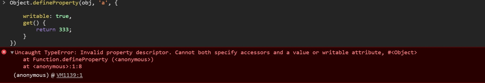

# 属性类型

属性类型分为两种

> 数据属性

| 属性           | 默认值       | 解释                                       |
| ------------ | --------- | ---------------------------------------- |
| value        | undefined | 属性对应的值                                   |
| configurable | true      | 是否可以删除、是否可以再次修改数据的属性configurable，能否把属性改为访问器属性 |
| enumerable   | true      | for in 是否可便利                             |
| writable     | true      | 是否可写                                     |

> 访问器属性

| 属性           | 默认值       | 解释                                       |
| ------------ | --------- | ---------------------------------------- |
| configurable | true      | 是否可以删除、是否可以再次修改数据的属性configurable,能否把属性改为数据属性 |
| enumerable   | true      | for in 是否可便利                             |
| set          | undefined | 设置属性值时会调用                                |
| get          | undefined | 访问属性值是会调用                                |

总结：

1. 通过new Object和字面量创建的对象上添加的属性均为数据属性，访问器属性必须通过defineProperty或者defineProperties定义

2. 通过 new Object和字面量创建的对象上添加的属性上的[[configurable]]、[[]writbable]、[[enumerable]]默认值为true

3. 一个对象的属性要么为访问器属性要么就是数据属性，二选一，不然会出错

   

