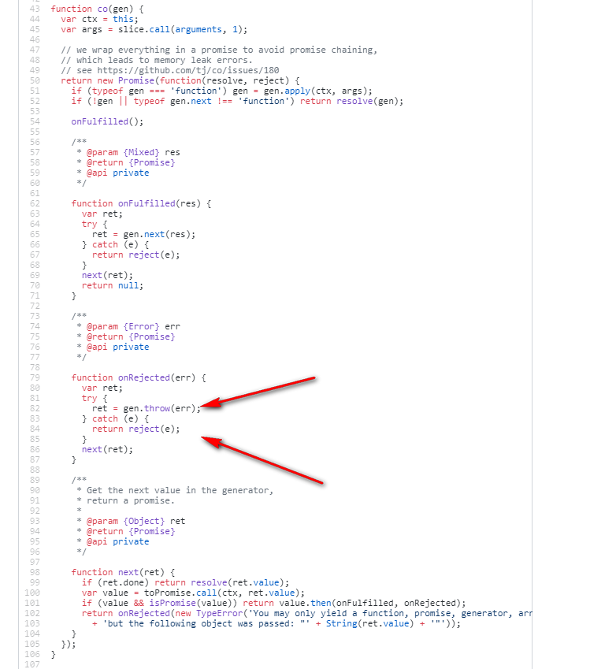

# 错误处理

## 案例一

```js
async function ayFun() {
  try {
    await Promise.reject('err')
          .catch(err => console.log('await后面promise捕获到错误', err))
  } catch(err) {
    console.log('内部try/catch捕获到的错误', err)
  }
}
ayFun()
  .catch(err => console.log('async的catch捕获到错误', err));
// 打印结果：await后面promise捕获到错误 err
// 为什么错误会走到await后的promise的catch中


async function ayFun() {
  try {
     await Promise.reject('err')
  } catch(err) {
    console.log('内部try/catch捕获到的错误', err)
  }
}
ayFun()
  .catch(err => console.log('async的catch捕获到错误', err));
// 打印结果：内部try/catch捕获到的错误 err
// 为什么错误会走到async函数里的try/catch中


async function ayFun() {
  await Promise.reject('err')
}
ayFun()
  .catch(err => console.log('async的catch捕获到错误', err));
// 打印结果：async的catch捕获到错误 err
// 为什么错误会走到async中的catch中
```

## 以上原因实际从promis的实现原理就可以弄明白，看一下tj大神的co库吧



### 解读

* 当promise自己没有catch住错误时，会调用gen.throw,那么我们在generator错误处理那一节讲了，generator迭代器外部throw的错误，如果内部有try/catch的话，内部会捕获错误，如果内部没有try/catch的话，外部的try/catch会捕获错误，进而会触发async的reject方法走到async的catch中
