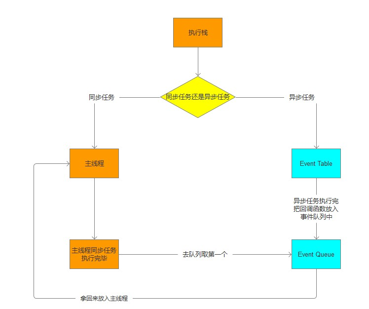
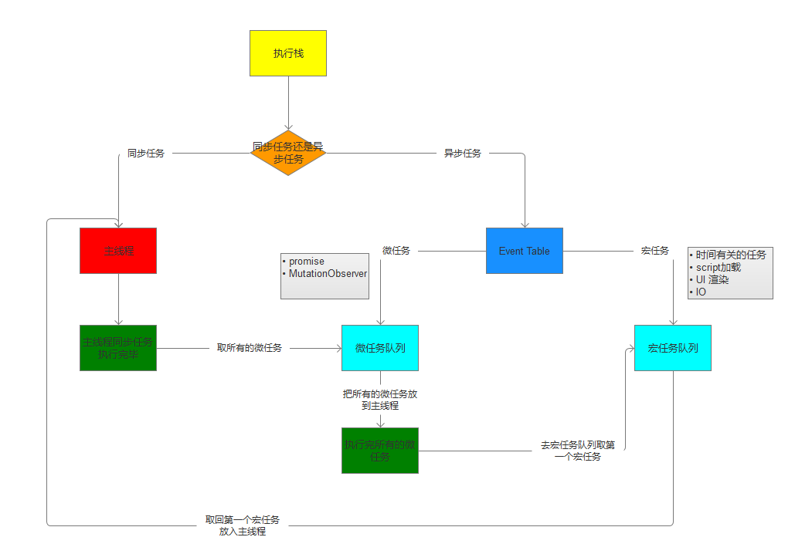

# 事件循环、宏任务/微任务

## js的执行机制是什么

>事件循环(不知道的要好好补补了)

## 事件循环

```javascript
console.log('script start');

setTimeout(function() {
  console.log('setTimeout');
}, 0);

console.log('script end');
```

我相信大部分人都能答出script start->script end -> setTimeout这样正确的顺序，why?估计会有很多人都答不上来，包括之前的我在内，那究竟是为什么呢，实际这个和js的事件执行机制有关，那我们就看看js的事件执行机制究竟是个什么鬼，我们看下边图



* 所有的函数都会进入执行栈
* 同步的任务会进入到主线程
* 异步任务进入到Event Table, Event Table中的异步任务执行完，就会把回调函数放到Event Queue中
* 主线程中的同步任务执行完后，浏览器会去Event Queue队列中找到header位置的函数放到主线程中执行

## 宏任务、微任务

```js
  console.log('script start');

setTimeout(function() {
  console.log('setTimeout');
}, 0);

Promise.resolve().then(function() {
  console.log('promise1');
}).then(function() {
  console.log('promise2');
});

console.log('script end');
```

我相信大部分人比较纠结的点是setTimeout和promise2的先后顺序，设个就涉及到了宏任务和微任务，我们在看下边图


* 同步任务执行完看是执行所有的微任务
* 微任务执行完开始执行宏任务中的第一个任务
* 宏任务执行万再执行所有的微任务，一直这样循环
